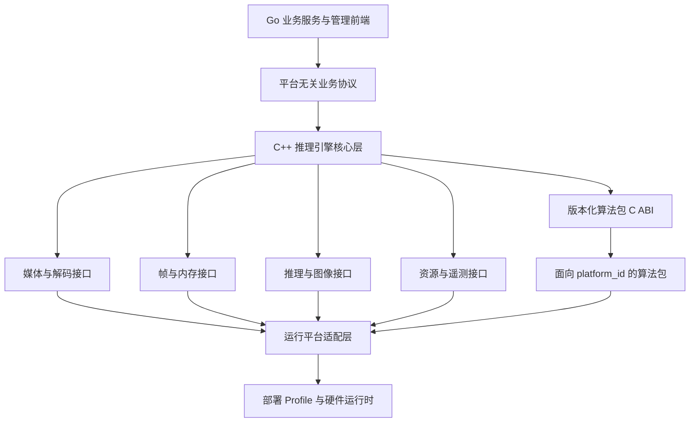
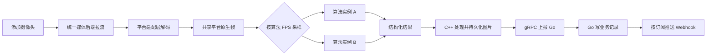
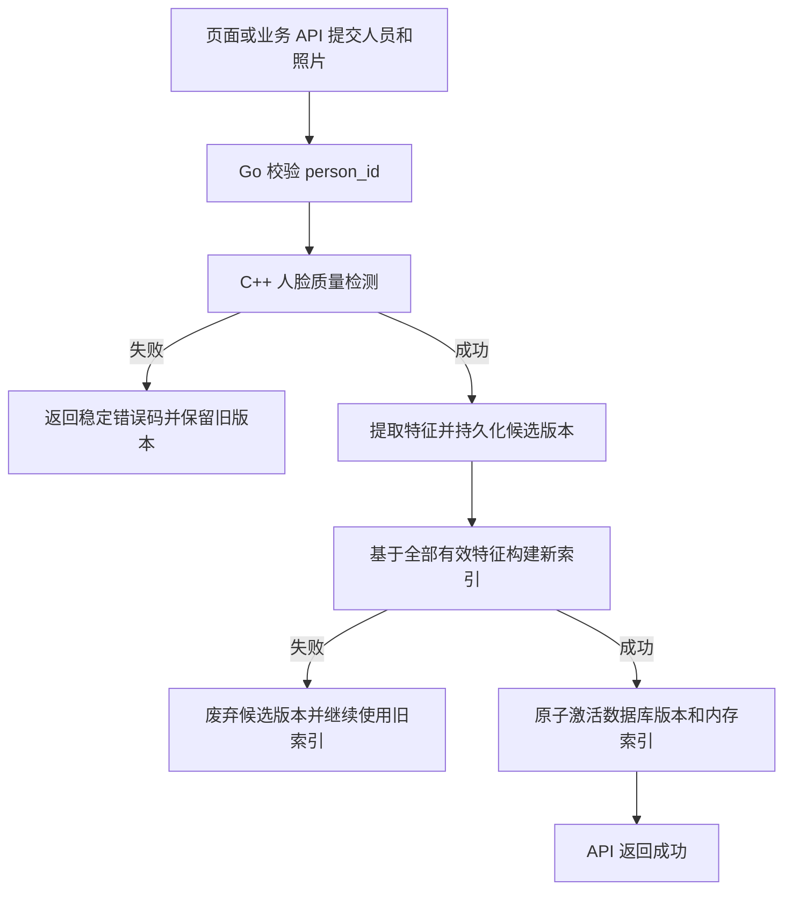
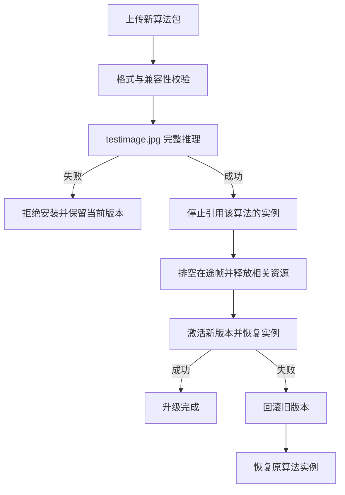
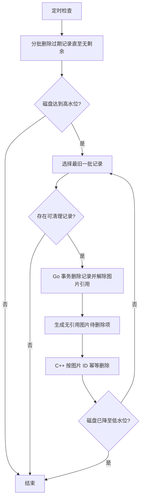

# AI 视频分析边缘平台 V1.0 产品需求文档

## 1. 文档信息

| 项目 | 内容 |
| --- | --- |
| 产品名称 | AI 视频分析边缘平台 |
| 英文名称 | AI Video Analytics Edge Platform |
| 文档版本 | V1.0 |
| 创建日期 | 2026-08-22 |
| 文档状态 | 待评审 |
| 目标平台 | 多平台架构；V1.0 首个实现和验收 Profile 为 Rockchip RK3576/RKNN |
| 部署形态 | 企业局域网内本地边缘部署 |

## 2. 修订历史

| 版本 | 日期 | 修订内容 | 状态 |
| --- | --- | --- | --- |
| V1.0 | 2026-08-22 | 根据需求访谈形成首版 PRD，并完善多运行平台抽象 | 待评审 |

## 3. 名词解释

| 术语 | 解释 |
| --- | --- |
| 平台 | 本 PRD 所定义的 AI 视频分析边缘平台，包括 Go 业务服务、C++ 媒体推理引擎和管理前端 |
| 运行平台 | 一组具体的硬件、操作系统、驱动、媒体栈和推理运行时，例如 `rk3576-rknn` |
| 平台适配层 | 将通用媒体、帧、图像、推理、资源和设备监控接口映射到某个运行平台的实现 |
| 平台能力档案 | 某个运行平台声明的输入格式、加速能力、资源容量、指标和版本兼容信息 |
| C++ 推理引擎 | 负责通用媒体任务、帧生命周期、算法调度、结果处理和图片生命周期，并通过平台适配层调用硬件能力 |
| 算法包 | 遵循平台 SDK 和 C ABI 规范，面向一个明确运行平台发布的模型、动态库、清单、配置 Schema 和测试图片集合 |
| 计算资源单位 | 平台用于启用前容量校验的抽象加速资源配额，由具体运行平台定义总容量和算法包档位 |
| 加速器 | 运行平台提供的推理或图像处理硬件，例如 RKNN 平台的 NPU、其他平台的 GPU/NPU |
| 摄像头任务 | 与一个摄像头通道一一对应的运行单元，可挂载多个算法实例 |
| 算法实例 | 某个算法包在一个摄像头任务中的运行实例，拥有独立运行配置 |
| 抓拍记录 | 每次满足人脸质量门槛的有效抓拍记录，无论是否识别成功 |
| 识别记录 | 抓拍与人员库比对成功后生成的结果记录 |
| 告警记录 | 目标检测算法包完成内部检测逻辑后，一次性回调产生的独立事件记录 |
| 底库图 | 人员当前或历史版本的人脸注册图片 |
| 候选列表 | 人脸比对返回的 Top-K 人员候选项，按相似度降序排列 |
| 高低水位 | 磁盘容量清理的启动阈值和停止阈值 |
| ZLM | V1.0 使用的 ZLMediaKit 媒体后端，统一负责摄像头拉流和视频预览媒体源 |

## 4. 产品概述

### 4.1 产品背景

工业园区和工厂通常依赖值班人员持续观看摄像头，人工发现效率受人员精力、视频路数和工作时长限制。同时，企业的人脸考勤、安全事件识别和现有业务系统往往相互割裂，摄像头视频难以转化为可消费的结构化数据。

本产品部署在企业局域网内的边缘设备上，将摄像头视频转换为抓拍、人员识别和安全告警记录，并通过可配置 Webhook 推送给业务系统。平台重点解决视频接入、算法包标准化、推理任务调度、结果持久化和业务集成问题，不承担考勤规则或具体安全算法的研发。首版在 RK3576/RKNN 运行平台上落地，但核心业务模型和算法包协议不绑定该硬件。

### 4.2 产品定位

产品定位为可扩展的本地 AI 视频推理与事件分发平台：

- 以无感考勤所需的人脸抓拍与识别为核心接入场景。
- 支持人员闯入、区域滞留、未佩戴安全帽、烟火等目标检测类算法接入。
- 将“人看摄像头”转变为“机器理解视频并生成结构化事件”。
- 通过统一算法包规范降低第三方算法接入和升级成本。
- 仅负责推理结果，不计算上班、下班、迟到、早退、缺卡或旷工等业务结果。

### 4.3 产品目标

1. 建立与具体硬件解耦的本地 AI 视频推理与事件分发平台。
2. 在首个 RK3576/RKNN Profile 上稳定接入并分析多路 1080p 网络视频。
3. 建立支持人脸识别和目标检测两类算法的统一算法包规范。
4. 支持一个摄像头任务挂载多个算法，并共享拉流和解码结果。
5. 保存抓拍、识别和告警记录，并可靠推送到一个或多个业务平台。
6. 支持算法包独立升级、回滚、配置热更新和平台无关的计算资源配额校验。
7. 通过新增平台适配层支持其他硬件、媒体栈、推理运行时和图像加速后端。

### 4.4 目标用户

| 用户 | 主要诉求 |
| --- | --- |
| 系统管理员 | 初始化设备，管理用户权限、算法包、摄像头、任务、人员、Webhook、存储和系统配置 |
| 运维人员 | 管理摄像头和任务，查看设备状态、业务记录和运行日志 |
| 只读用户 | 查看设备状态及抓拍、识别、告警记录 |
| 外部业务系统 | 同步人员，通过 Webhook 消费抓拍、识别和告警事件，并自行计算考勤或处置业务 |
| 算法开发者 | 按统一 SDK 开发、测试和发布面向目标硬件的算法包 |

### 4.5 用户痛点

- 人工持续观看多路视频成本高，容易漏掉关键事件。
- 不同算法的安装、配置、结果格式和升级方式不统一。
- 同一路视频被多个算法重复拉取或解码，浪费边缘设备资源。
- 人脸识别结果难以与业务系统人员 ID 稳定对应。
- 本地网络或业务端故障时，事件推送缺少重试和查询能力。
- 边缘设备存储有限，图片和记录持续增长可能导致磁盘写满。
- 算法包升级可能影响无关摄像头或其他算法任务。

## 5. 范围定义

### 5.1 V1.0 范围

- 首个运行平台为 RK3576/RKNN，完成该 Profile 的本地部署和性能验收。
- 平台无关的核心业务、算法包 ABI、帧描述符、结果协议、配置 Schema 和资源模型。
- ONVIF 自动发现和手工 RTSP 摄像头接入。
- H.264/H.265、1080p、最高 25 FPS 视频输入。
- 基于 V1.0 媒体后端的实时视频预览，不叠加算法结果。
- 摄像头任务及多算法实例管理。
- 人脸识别、目标检测两类算法包规范。
- 算法包 SDK、安装校验、测试推理、升级、回滚和卸载保护。
- 基于 Schema 的算法参数配置及原子热更新。
- 10,000 人、每人一张人脸照片的人员库。
- 抓拍、识别、Top-K 候选和告警记录。
- 多平台 Webhook、独立订阅、重试和手动重推。
- 图片签名 URL 和可选 Base64 模式。
- 设备资源监控及历史折线图。
- 数据留存和磁盘高低水位滚动清理。
- 基于现有脚手架 RBAC 和操作日志的权限及审计。
- YOLOv8n RKNN 最小示例算法包。

### 5.2 非目标

- 不研发生产级人脸、入侵、滞留、安全帽或烟火算法。
- 不计算考勤班次和考勤结果。
- 不提供陌生人检测、陌生人聚类或身份级陌生人去重。
- 不提供云端部署和跨设备集中管理。
- 不提供 PTZ 云台控制。
- 不提供连续录像和录像回放。
- 不保存事件短视频，仅保存图片。
- 不提供告警确认、处理中、关闭或误报等处置状态机。
- 不提供批量记录导出。
- 不在 V1.0 实现 CUDA、昇腾等其他运行平台；但必须完成平台适配接口、能力档案和算法包协议设计，使后续平台可以独立接入。
- 不把 RKNN、MPP、RGA、ZLM 或 NPU 专属字段作为通用业务协议。
- 不要求算法包数字签名。

## 6. 系统边界与部署要求

### 6.1 服务职责

| 组件 | 职责 |
| --- | --- |
| Go 业务服务 | RBAC、业务 API、人员业务事务、人脸特征持久化、摄像头和任务配置、记录数据库、Webhook、存储策略、操作日志、监控数据和查询接口 |
| C++ 媒体推理引擎 | 通用媒体任务、帧生命周期、算法包运行时、任务调度、结果处理和图片生命周期；通过平台适配层调用媒体、推理和图像加速能力 |
| 平台适配层 | 为具体运行平台提供媒体接入、解码、帧句柄、推理上下文、图像处理、图片编码、资源配额和设备指标实现 |
| PostgreSQL | 业务配置、结构化记录、人脸特征、图片元数据、Webhook 投递状态和监控历史数据 |
| 管理前端 | 面向 RBAC 用户提供设备、摄像头、任务、算法、人员、记录、Webhook、存储和监控界面 |

### 6.2 进程与通信

- Go 服务和 C++ 推理引擎为独立进程。
- V1.0 的 `rk3576-rknn` Profile 将 ZLMediaKit 作为媒体库嵌入 C++ 推理引擎，不建立推理回环拉流。
- Go 与 C++ 的通用通信契约使用 gRPC/Protobuf；本地传输方式由部署 Profile 决定，V1.0 使用 Unix Domain Socket。
- 摄像头视频帧不得跨 Go/C++ 进程传输。
- 跨进程常规消息仅传递命令、状态、结构化结果、图片 ID 和受限相对路径。
- 人员新增或更新是例外：Go 通过有大小上限的本机 gRPC 请求向 C++ 传递单张注册图片；C++ 持久化底库图并返回图片 ID、质量结果和特征字节，Go 将特征写入 PostgreSQL。
- 断线重连后，以 Go 保存的任务期望状态进行全量对账，不依赖可能丢失的增量命令。
- 服务启动、异常拉起、日志轮转和有序停止由部署 Profile 定义；V1.0 使用 systemd。

### 6.3 多平台适配与能力档案

- 平台核心层不直接依赖 RKNN、MPP、RGA、ZLM、CUDA 或其他具体实现。
- 每个运行平台通过独立适配层注册唯一 `platform_id`，并提供版本化能力档案。
- 能力档案至少声明：CPU 架构、操作系统/BSP、媒体接入方式、支持的编码和帧格式、内存句柄类型、推理运行时、图像处理能力、图片编码能力、可用计算资源、监控指标和兼容版本。
- 通用帧描述符只定义跨平台字段和扩展字段；平台私有句柄放在不透明扩展中。
- 通用算法包 C ABI、配置 Schema、结果 Schema、任务模型和业务记录模型不得包含平台私有类型。
- 算法包清单声明 `platform_id`、最低适配层版本、支持的帧能力和资源档位；一个算法包构建只面向一个明确运行平台。
- 同一算法面向多个运行平台时分别构建和发布，平台按 `platform_id` 选择兼容包。
- 平台创建任务、安装算法包和启用算法实例前，必须完成能力协商；不满足能力时返回结构化不兼容原因。
- 每台设备安装时只激活一个 `platform_id`，运行期间不支持跨硬件平台切换；多平台能力指同一核心代码可通过不同适配层构建和部署到不同设备。
- 平台适配层可以按部署 Profile 静态链接或动态加载，但不得改变通用业务协议和算法包 C ABI。
- V1.0 实现 `rk3576-rknn` 适配层，并交付一个不访问真实硬件的契约测试适配器；后续平台只需新增适配层、能力档案和对应算法包。

### 6.4 部署 Profile

- 通用产品不规定具体进程管理器、驱动安装方式或媒体库。
- 每个运行平台必须提供独立部署 Profile，声明服务拓扑、进程管理方式、依赖库、设备节点、环境变量、端口、升级和回滚要求。
- V1.0 的 `rk3576-rknn` Profile 采用宿主机原生部署和 systemd，C++ 推理引擎嵌入 ZLMediaKit，并使用该 Profile 验证过的 RKNN Runtime、MPP、RGA 和硬件 JPEG 能力。

## 7. 功能需求

### 7.1 设备初始化与系统配置

#### 7.1.1 设备标识

- 初始化时允许管理员或部署工具指定 `device_id`。
- 未指定时由平台自动生成 UUID。
- 初始化完成后 `device_id` 不可修改。
- 提供可修改的 `device_name`。
- 所有 Webhook 事件必须包含 `device_id`。

#### 7.1.2 时间管理

- 事件业务时间使用边缘设备接收对应视频帧时的系统时间。
- 时间以 UTC 持久化，前端按设备配置时区显示。
- 支持 NTP 服务器配置和同步状态展示。
- 系统时间未同步时继续推理，但记录和 Webhook 必须包含 `time_synced=false`。
- 帧 PTS 可作为内部诊断字段，但不得作为绝对业务时间。

#### 7.1.3 运行平台信息

- 系统必须展示当前 `platform_id`、适配层版本、硬件型号、操作系统/BSP、推理运行时和媒体后端版本。
- 系统必须展示平台能力档案及每项能力的可用、不可用或降级状态。
- 业务配置不得要求用户填写 RKNN、CUDA 等平台私有参数；平台私有诊断配置放在对应部署 Profile 的高级设置中。
- 平台能力档案变化后，系统必须重新校验已安装算法包和已启用任务，并明确标记不兼容项，不得静默启动。

### 7.2 摄像头管理

#### 7.2.1 摄像头发现与添加

- 支持通过 ONVIF 自动发现局域网摄像头。
- 发现结果展示设备地址、厂商、型号和可用媒体 Profile。
- 管理员输入凭证后选择 Profile，平台解析并保存对应 RTSP 地址。
- 支持手工填写 RTSP URL，以兼容跨 VLAN、关闭 ONVIF 或不兼容设备。
- 同一设备的不同 Profile 或通道允许分别添加。
- 首版不实现 PTZ 控制和录像回放。

#### 7.2.2 视频兼容性

- 支持 RTSP、H.264/H.265、1080p、最高 25 FPS。
- 支持用户名密码鉴权。
- 支持 RTSP TCP/UDP 传输模式选择。
- 支持断线自动重连和连接状态展示。

#### 7.2.3 统一媒体源

- 通用层通过媒体后端能力统一管理摄像头上游连接，推理和预览必须复用同一个媒体源。
- 不允许媒体后端和推理模块分别建立同一摄像头的上游 RTSP 连接。
- 媒体回调只允许将编码帧引用转移到有界队列，不得执行解码、数据库、磁盘、Webhook 或推理等阻塞工作。
- V1.0 的 `rk3576-rknn` Profile 使用 ZLM MediaSource 和 Track 回调实现该能力。

#### 7.2.4 断流恢复

- 断流后任务进入“重连中”，暂停向算法分发帧，但保留算法上下文和配置。
- 按可配置退避间隔持续重连，不限制最终重试次数。
- 超过可配置时长后标记“离线”，并降低重试频率。
- 视频恢复后自动继续分析。
- 断流和恢复写入运行日志，不生成业务告警，不触发算法 Webhook。

### 7.3 视频预览

- 通过当前运行平台声明的预览能力提供实时视频预览；V1.0 使用嵌入 C++ 推理引擎的 ZLMediaKit。
- 具体浏览器输出协议由部署 Profile 的媒体后端能力声明。
- 预览按需建立，无观看者时释放预览会话资源，但不得停止算法任务所需的上游拉流。
- 预览不叠加目标框、规则区域、事件类型、置信度或识别结果。
- 不提供录像、回放和下载。

### 7.4 摄像头任务与算法实例

#### 7.4.1 任务模型

- 一个摄像头通道对应一个任务。
- 一个任务可以配置多个算法实例。
- 同一任务中的算法共享一次上游连接和一次平台解码结果。
- 每个算法实例具有独立的运行参数、采样 FPS、状态和计算资源占用。

#### 7.4.2 期望状态与恢复

- 任务持久化“期望状态”和“实际状态”。
- 设备或服务重启前处于启用状态的任务必须自动恢复。
- 原本停用的任务保持停用。
- 恢复时先加载共享模型，再按受控并发逐步恢复摄像头和算法实例。
- 单个任务恢复失败不得阻塞其他任务。

#### 7.4.3 多算法帧调度

- C++ 推理引擎向算法提供共享的平台原生解码帧，不固定像素格式、内存类型或硬件句柄。
- 通用帧描述符至少包含 `platform_id`、内存类型、像素格式、布局或压缩模式、有效宽高、分配宽高、平面 offset、stride、modifier、时间戳、`frame_id` 和不透明平台扩展。
- 算法包声明支持的帧格式、内存类型和所需平台扩展，创建实例时进行能力协商。
- 不兼容时拒绝启用并返回明确原因。
- 每个算法按自身配置独立采样。
- 每个算法实例使用容量受限的帧队列；过载时丢弃较旧的等待帧并保留最新帧。
- 单个算法积压不得阻塞解码或其他算法实例。

#### 7.4.4 帧生命周期

- 平台向算法提供只读引用计数帧句柄。
- 算法处理期间持有句柄，结果回调完成后释放。
- 所有引用归零前不得复用底层帧缓冲。
- 算法不得释放平台持有的原生内存句柄，也不得长期保存无引用的地址、fd 或私有句柄。
- 算法超时后停止向该实例分发新帧，但不得强制复用仍可能被算法访问的缓冲。

### 7.5 算法包规范与 SDK

#### 7.5.1 算法类型

算法包必须在清单中声明唯一主类型：

| 枚举 | 含义 | 平台记录行为 |
| --- | --- | --- |
| `face_recognition` | 人脸抓拍、质量评估、特征比对和候选返回 | 生成抓拍记录；达到阈值时生成识别记录 |
| `object_detection` | 目标检测及算法内部事件判定 | 每次回调直接生成一条告警记录 |

目标检测包内部负责检测、跟踪、区域判断、连续帧判断、事件聚合和去重。平台不接收普通逐帧检测框，不二次判断是否告警。

#### 7.5.2 包内容

每个算法包至少包含：

- 算法清单文件。
- 目标运行平台动态库。
- 模型文件和必要依赖。
- 参数 JSON Schema 和 UI 元数据。
- `testimage.jpg`。
- SDK/API 版本及兼容信息。
- 支持的帧能力。
- 计算资源档位声明。
- 算法 ID、名称和语义化版本。

#### 7.5.3 ABI 要求

- 动态库对平台只暴露版本化 C ABI。
- 算法包内部允许使用 C++。
- 跨 ABI 不传递 STL 容器、C++ 对象或异常。
- 使用明确布局的结构体、字节缓冲、不透明句柄和错误码。
- 结构体包含 `size` 和 `api_version`，支持兼容扩展。
- 内存由分配方释放，所有权必须在 SDK 文档中明确。

#### 7.5.4 安装校验

平台上传算法包后必须执行：

1. 校验压缩包结构和必需文件。
2. 校验清单字段、文件校验和、接口版本、`platform_id` 和能力档案兼容性。
3. 校验路径安全，禁止包内容逃逸安装目录。
4. 加载动态库和模型。
5. 使用包内 `testimage.jpg` 完成一次预处理、推理、后处理和结果序列化。
6. 校验结果可以解析并符合统一结果 Schema。
7. 校验过程不得崩溃或超过平台超时。

平台不验证测试图片的算法精度、类别语义或预期目标，算法正确性由算法包开发方负责。首版不要求数字签名，但保存 SHA-256 供完整性和版本追踪使用。

#### 7.5.5 版本与升级

- 同一 `algorithm_id + platform_id` 同一时间只允许一个激活版本。
- 可保留一个旧版本用于自动回滚。
- 任务绑定 `algorithm_id`，不固定具体版本。
- 升级时只停止所有使用该算法包的算法实例。
- 摄像头拉流、解码和同任务内其他算法继续运行。
- 排空在途帧并释放相关推理上下文后安装和校验新版本。
- 升级成功后按原配置自动恢复相关算法实例。
- 安装、加载或初始化失败时自动回滚旧版本并恢复实例。
- 人脸算法包升级时必须比较人脸特征契约标识；契约变化时，使用现有底库图为全部有效人员重提特征并构建候选索引，全部成功后才能激活新版本。迁移失败时保留旧算法、旧特征和旧索引。
- 仍有任何任务配置引用时，禁止卸载算法包。
- 卸载不删除历史告警中的算法 ID、名称和版本快照。

#### 7.5.6 示例算法包

- 项目交付算法包 SDK 和一个面向 `rk3576-rknn` 的 YOLOv8n 最小示例包。
- 示例包类型为 `object_detection`。
- 支持热更新目标类别列表和置信度阈值。
- 检测到配置类别后，由示例包输出标准一次性告警事件。
- 示例包用于验证安装、测试推理、任务挂载、配置热更新、资源申报、结果回调、升级和回滚。
- YOLOv8n 检测精度不属于平台项目验收范围。
- 示例包必须固定并记录源模型与平台模型的身份、转换配置、转换工具版本、`platform_id`、量化校准来源、构建报告、推理运行时和驱动兼容版本。`rk3576-rknn` 示例需额外保留 ONNX/RKNN SHA-256、Toolkit2 配置和报告。

### 7.6 算法参数配置

- 算法包使用受限 JSON Schema 和 UI 元数据声明运行参数。
- 平台根据 Schema 动态生成通用配置表单，不为单个算法开发专用页面。
- 不允许算法包注入自定义前端 JavaScript。
- 支持布尔、字符串、枚举、整数、小数、滑块、颜色、类别多选、矩形和多边形区域等标准字段。
- 运行参数包括但不限于分析 FPS、阈值和规则区域。
- 整份配置必须原子热更新：全部接受并立即生效，或拒绝并保持旧配置。
- 平台完成 Schema 基础校验，算法实例完成最终校验。
- 仅在算法实例确认成功后持久化新配置。
- FPS 更新必须先通过当前运行平台的计算资源配额校验。

#### 7.6.1 区域坐标规范

- 原点位于视频有效画面左上角。
- 横纵坐标统一为 `[0,1]` 归一化坐标。
- 平台负责预览坐标与归一化坐标转换。
- 算法包按当前帧有效宽高还原坐标。
- 多边形至少包含 3 个顶点，不允许越界或自交。

### 7.7 计算资源管理

- 每个运行平台通过能力档案声明一种可加和的计算资源单位和总容量；通用业务层不使用 NPU 核数、CUDA Core、TOPS 等硬件私有指标直接调度。
- 为统一管理界面，每个运行平台将加速计算总容量归一化为 1000 个资源单位，并声明不高于 1000 的可分配上限和安全保留量。
- 算法包根据目标运行平台实测，按输入规格、精度和 FPS 档位声明资源单位；不同 `platform_id` 的数值不可横向比较。
- 平台汇总当前设备所有启用算法实例的资源单位。
- 新增、启用或修改算法 FPS 后超过可分配容量时拒绝操作，并提示受限资源。
- 不允许根据模型文件大小或标称 TOPS 推算资源消耗。
- 内存不参与常规计算配额加和，但每个运行平台必须声明最低可用内存安全阈值；低于阈值时拒绝启动并回滚。
- 同一模型的并发工作单元使用独立推理上下文，并以复用只读模型资源为目标；是否支持共享、共享范围和释放语义由平台能力档案声明并经实测确认。
- `rk3576-rknn` Profile 使用 NPU 作为主要加速器；上下文共享收益必须在固定 RKNN Runtime 和驱动组合上通过 `RKNN_QUERY_MEM_SIZE`、RSS/PSS 等实测确认。

### 7.8 人员管理与同步

#### 7.8.1 人员模型

- 数据库内部主键为 `id`，不对外暴露。
- 对外唯一标识为 `person_id`。
- 页面创建时 `person_id` 选填；未填写时平台自动生成。
- 手工填写时校验设备内唯一。
- 业务同步 API 必须提供 `person_id`，用于幂等新增、更新和删除。
- `person_id` 创建后不可修改。
- 每个人员首版只允许一张当前有效人脸照片。
- 页面和业务 API 操作同一人员模型，不区分数据来源；后一次成功操作覆盖前一次结果。

#### 7.8.2 管理方式

- 管理页面支持人员新增、修改、删除和查询。
- 外部业务系统使用独立同步 API 进行人员增删改。
- 同步 API 采用 IP 白名单保护。
- 白名单支持 IPv4/IPv6 单地址和 CIDR。
- 默认拒绝所有来源。
- 使用 TCP 真实连接源地址匹配，默认不信任 `X-Forwarded-For`。
- 白名单修改立即生效，并接入操作日志。

#### 7.8.3 人脸质量准入

- C++ 推理引擎负责底库图质量检测和特征提取。
- 图片必须且只能检测到一张人脸。
- 校验最小人脸尺寸、清晰度、姿态和遮挡等可配置质量门槛。
- 不合格时返回稳定错误码，例如未检测到人脸、多张人脸、人脸过小、图像模糊、姿态超限或特征提取失败。
- 更新失败时保留旧照片、旧特征和旧索引继续识别。

#### 7.8.4 特征与索引

- 人脸特征使用 PostgreSQL `bytea` 持久化。
- 每条特征必须绑定产生它的算法 ID、算法版本和不可变 `feature_contract_id`；该标识表示特征维度、数据类型、归一化及距离度量契约。
- 目标底库规模为 10,000 人。
- C++ 完成质量检测和特征提取后，将底库图 ID、质量结果和特征字节返回 Go；Go 将人员、图片元数据和特征写入数据库候选版本。
- Go 将候选版本的全部有效特征快照通过本机 gRPC 发送给 C++，由 C++ 构建候选内存索引。
- 人员新增、更新或删除后，均基于全部有效特征构建候选新索引。
- 索引构建期间识别继续使用旧索引。
- 使用“候选版本 + 激活版本”保证数据库与内存索引一致。
- 新索引构建和原子切换成功后，人员 API 才返回成功。
- 构建失败时废弃候选版本，旧数据库激活版本和旧索引继续有效。
- 服务重启只加载已激活版本，未完成候选版本不得误加入识别库。

#### 7.8.5 人员照片版本

- 新增或更新照片时生成不可变底库图版本。
- 新版本质量检测、特征提取、索引构建和激活全部成功后才切换为当前版本。
- 旧版本立即停止参与识别，但可继续被历史记录引用。
- 人员删除后立即退出有效人员库和人脸索引，不再参与识别。
- 历史抓拍、识别和候选记录保存 `person_id`、姓名等必要文本快照。
- 底库图版本被最后一条历史记录解除引用后，才允许物理删除。

### 7.9 人脸抓拍与识别

#### 7.9.1 结果规则

人脸算法处理结果分为：

1. 质量不达标：不生成抓拍，不比对，不推送。
2. 质量达标但最高相似度低于阈值：生成抓拍记录，不生成识别记录。
3. 质量达标且最高候选达到阈值：生成抓拍记录和一条关联识别记录。

不提供陌生人告警或陌生人身份聚类，但允许未识别抓拍落库。

#### 7.9.2 抓拍记录

每条抓拍记录至少包含：

- 抓拍 ID。
- 发生时间和时间同步状态。
- 设备、摄像头和任务标识。
- 抓拍图片 ID。
- 人脸质量信息。
- 已识别/未识别状态。
- 算法 ID 和版本快照。
- Top-K 候选列表。

#### 7.9.3 识别记录

每条识别记录至少包含：

- 识别 ID。
- 关联抓拍 ID。
- `person_id` 和姓名快照。
- 相似度和识别状态。
- 命中的底库图版本 ID。
- 发生时间、设备、摄像头和任务标识。
- 算法 ID 和版本快照。

#### 7.9.4 候选列表

- 默认保存 Top 5，可配置为 1～10。
- 按相似度降序排列。
- 每项保存 `person_id`、姓名快照、相似度和底库图版本引用。
- 抓拍详情展示抓拍图和各候选底库图。
- 候选项不代表识别成功，只有最高候选达到阈值才生成识别记录。

#### 7.9.5 重复控制

- 同一连续 Track 只生成一组抓拍和识别记录。
- Track ID 只用于连续可见过程中的最佳图筛选，不作为跨时间身份。
- 已识别人员在 Track 结束后，按 `person_id + camera_id` 进行身份冷却。
- 冷却默认 5 秒，可配置范围 0～60 秒。
- 冷却结束后再次识别可生成新记录并推送。
- 未识别人脸允许因 Track 重建产生重复抓拍。
- 每摄像头抓拍速率上限默认 2 条/秒并可配置；超过时优先保留质量更高的抓拍。

### 7.10 目标检测与告警

- 目标检测算法包每次回调代表一条完整、独立的告警记录。
- 算法包内部负责全部检测逻辑、事件聚合和去重。
- 平台收到回调后直接落库，不维护开始、更新、结束或处置状态机。
- 每条结果必须携带唯一 `event_id`；重复 `event_id` 按幂等规则忽略。
- 告警记录至少包含事件类型、发生时间、时间同步状态、设备、摄像头、任务、算法 ID、算法版本、目标框、规则区域、截图和置信度。
- 目标框和规则区域使用统一归一化坐标。
- 不保存事件视频。

### 7.11 图片处理与生命周期

- 所有图片文件由 C++ 图片模块统一管理，包括抓拍图、告警图和人员底库图。
- C++ 根据算法结果和共享帧，通过当前平台适配层完成裁剪、缩放、颜色转换、标注和 JPEG 编码。
- 平台能力档案声明图像处理和 JPEG 编码是硬件加速、软件实现或不可用；通用业务流程不得直接调用 RGA、CUDA、MPP 等私有 API。
- `rk3576-rknn` Profile 优先使用 RGA 完成适用的裁剪、缩放和颜色转换，并使用目标 BSP 可用的硬件 JPEG 能力。
- 图片通过临时文件加原子重命名方式写入最终路径，禁止业务读取未完成文件。
- Go 只保存图片 ID、受限相对路径和业务关联，不向 C++ 传递任意文件系统删除路径。
- Go 根据留存和引用规则决定待删除业务记录，通过 gRPC 按图片 ID 请求 C++ 批量删除。
- C++ 返回逐项删除结果；删除接口必须幂等。
- C++ 写图成功但 Go 业务落库失败形成的孤儿文件必须可对账并定期清理。
- 人员底库图的物理删除必须以历史引用归零为前提。

### 7.12 记录查询

#### 7.12.1 抓拍记录

支持按以下条件组合查询：

- 时间范围。
- 摄像头。
- 任务。
- 已识别/未识别。

#### 7.12.2 识别记录

支持按以下条件组合查询：

- 时间范围。
- 摄像头。
- 任务。
- `person_id`。
- 姓名。
- 相似度范围。

#### 7.12.3 告警记录

支持按以下条件组合查询：

- 时间范围。
- 摄像头。
- 任务。
- 算法。
- 事件类型。
- 置信度范围。

#### 7.12.4 通用规则

- 列表按发生时间倒序分页。
- 详情展示结构化字段和关联图片。
- 首版不提供批量导出。

### 7.13 Webhook 平台

#### 7.13.1 多平台配置

每个 Webhook 平台独立配置：

- 名称和 URL。
- 启用状态。
- 订阅类型：抓拍、识别、告警。
- 请求超时。
- 最大重试次数。
- 自定义静态 HTTP 请求头。
- 图片传递模式：URL 或 Base64。

多个平台的投递状态相互独立，一个平台失败不得影响其他平台、记录落库或实时推理。

#### 7.13.2 事件信封

Webhook 统一使用以下事件信封：

```json
{
  "event_id": "uuid",
  "event_type": "capture.created",
  "occurred_at": "2026-08-22T10:00:00Z",
  "device_id": "edge-001",
  "camera_id": "camera-001",
  "time_synced": true,
  "data": {}
}
```

- `event_type` 首版固定为 `capture.created`、`recognition.created` 和 `alarm.created`。
- `data` 必须包含对应记录 ID、任务标识、算法 ID、算法版本和图片对象；抓拍增加质量与识别状态，识别增加抓拍 ID、`person_id`、姓名快照和相似度，告警增加业务事件类型、置信度、目标框和规则区域。
- 图片对象按平台配置二选一携带签名 URL 或 JPEG Base64，不得同时省略。
- 重试时 `event_id` 和业务载荷保持不变，签名图片 URL 可重新生成。
- 业务端必须按 `event_id` 幂等处理。
- 不承诺全局严格顺序，不同事件允许并发和乱序。
- 业务端使用 `occurred_at` 判断事件业务时间。

#### 7.13.3 投递与重试

- HTTP `2xx` 视为成功。
- 其他状态码、连接失败和超时视为失败。
- 默认总超时 10 秒。
- 首次投递失败后默认最多重试 3 次，即单个平台单条事件最多尝试 4 次。
- 重试采用退避间隔，具体间隔可配置。
- 达到上限后标记“推送失败”，停止自动重试。
- 管理员可在记录详情手动重新推送。
- 同一事件对不同平台分别保存尝试次数、最后响应状态和最终状态。
- 记录到期或因磁盘水位被清理后，不再继续投递。

#### 7.13.4 自定义请求头

- 每个平台支持多个静态请求头，例如 `Authorization`、`X-API-Key` 和 `X-Tenant-ID`。
- 不允许覆盖平台控制的协议必需字段。
- 首版不强制 HMAC 签名。
- 按 RBAC 菜单和操作权限决定谁可以查看或修改完整凭证。

#### 7.13.5 图片传递

- 默认使用局域网可访问的图片 URL。
- 图片下载 URL 使用短期签名，无需业务端登录。
- URL 包含记录标识、过期时间和签名，禁止修改 ID 越权访问其他图片。
- 默认有效期 10 分钟，可按 Webhook 平台配置 1～60 分钟。
- Webhook 重试时重新生成签名 URL。
- 记录或图片已被清理后返回不可用。
- 可选将 JPEG Base64 内嵌到 JSON，启用时受图片尺寸和请求体上限约束。
- Base64 模式的图片尺寸和请求体上限必须可配置；超过上限时本次投递失败并进入正常重试流程，不得静默截断数据。

### 7.14 数据留存与容量保护

- 抓拍、识别和告警记录默认保留 7 天，保留天数可配置。
- 图片与结构化记录关联清理。
- 到期清理与容量清理是两条独立流程：到期清理仅删除超过保留期的数据，直至无过期记录。
- 磁盘使用率达到默认高水位 85% 时启动容量清理；容量清理按记录发生时间从旧到新 FIFO 删除，不区分是否过期或 Webhook 是否成功。
- 每批最多处理 500 条记录及关联图片。
- 容量清理每批完成后重新检查磁盘使用率，降至默认低水位 75% 后停止；没有可清理记录时也必须停止并记录原因。
- 每批记录先在 Go 数据库事务中标记删除、解除底库图版本引用并生成待删除图片项；只有引用计数归零的底库图才进入图片删除队列。
- C++ 按图片 ID 幂等执行物理删除。逐项删除失败时保留待删除项供后续重试，不得恢复已完成的业务记录删除，也不得提前删除仍被历史记录引用的底库图。
- 保留天数、高水位、低水位和批次大小均可配置。
- 必须满足低水位小于高水位。
- 不要求为被容量策略删除的未推送记录生成额外数据丢失通知。

### 7.15 设备监控

通用监控指标固定为：

- 设备运行时间。
- CPU 使用率。
- 内存使用率。
- 磁盘水位。
- 加速器负载。
- 设备温度。

平台适配规则：

- 每个运行平台将自身指标映射到上述通用指标 ID，并在能力档案中声明采集来源、单位、取值范围和是否可用。
- 不支持的指标必须显示“当前平台不支持”，不得伪造为 0。
- 多加速器或多温度传感器平台必须同时提供汇总值和可选明细；折线图默认展示汇总值。
- `rk3576-rknn` Profile 的加速器负载显示 NPU 负载，温度使用该 Profile 明确指定的设备传感器。

数据规则：

- 每 10 秒采集一次当前状态。
- 每分钟持久化一条聚合数据。
- 默认保留 30 天。
- 页面展示当前值和历史折线图。
- 时间范围支持最近 1 小时、24 小时、7 天和 30 天。
- 首版不提供设备指标阈值告警。
- 摄像头、任务、算法和 Webhook 仅展示各自业务状态，不纳入监控时序指标范围。

### 7.16 权限与操作日志

#### 7.16.1 预置角色

| 角色 | 默认能力 |
| --- | --- |
| 系统管理员 | 管理所有系统功能 |
| 运维人员 | 管理摄像头和任务，查看设备状态、业务记录和日志，不默认管理用户与算法包 |
| 只读用户 | 查看监控、任务状态和三类业务记录 |

最终权限由现有 RBAC 菜单、接口和操作权限决定，不在代码中按角色写死。拥有对应菜单及接口权限的用户可以查看该页面中的完整摄像头凭证或 Webhook 请求头；修改能力由对应操作权限控制。

#### 7.16.2 操作日志

复用现有操作日志模块，只记录写操作。以下操作必须接入：

- 用户和权限变更。
- 摄像头增删改。
- 任务及算法实例启停。
- 算法参数热更新。
- 算法包安装、升级、回滚和卸载。
- 人员增删改。
- Webhook 配置。
- IP 白名单。
- 存储策略和系统配置。

日志至少包含操作者、时间、来源 IP、模块、动作、操作对象、结果和变更摘要。请求体沿用现有脱敏机制，不记录完整人脸图片、摄像头密码或 Webhook 敏感头内容。普通查看行为不写操作日志。

## 8. 核心流程

### 8.1 多平台分层关系



约束：核心层只依赖版本化通用接口；适配层和目标平台算法包允许使用平台私有能力；新增运行平台不得修改业务记录、Webhook、任务模型或通用算法包 ABI。

### 8.2 摄像头任务运行流程



### 8.3 人员新增或更新流程



### 8.4 算法包升级流程



### 8.5 数据清理流程



## 9. 异常场景

| 异常情况 | 处理要求 | 用户可见状态 |
| --- | --- | --- |
| 摄像头断流 | 保留算法上下文，持续退避重连，恢复后自动分析 | 重连中/离线 |
| 单个算法队列积压 | 丢弃旧等待帧，保留最新帧，不阻塞其他算法 | 算法继续运行 |
| 计算资源配额不足 | 拒绝启用或 FPS 热更新，不影响现有实例 | 显示资源不足原因 |
| 可用内存低于安全阈值 | 拒绝加载并回滚 | 启动失败 |
| 算法配置校验失败 | 整份配置拒绝，继续使用旧配置 | 显示字段或算法错误 |
| 算法包自测失败 | 拒绝安装，不停止当前版本 | 安装失败 |
| 算法包升级失败 | 自动回滚旧版本并恢复相关实例 | 升级失败、已回滚 |
| Go/C++ 通信中断 | 重连后按期望状态全量对账 | 服务恢复中 |
| C++ 推理引擎异常退出 | 由当前部署 Profile 的进程管理器自动拉起，恢复启用任务 | 短时不可用后恢复 |
| 人脸照片不合格 | 返回稳定质量错误码，不改变旧人员版本 | 同步失败 |
| 人脸索引重建失败 | 废弃候选版本，继续使用旧索引 | 操作失败、旧数据有效 |
| Webhook 失败 | 独立重试最多 3 次，失败后支持手动重推 | 推送失败 |
| 图片签名 URL 过期 | 拒绝下载；Webhook 重试生成新 URL | 链接已过期 |
| 磁盘达到高水位 | FIFO 分批清理至低水位，即使数据未推送成功 | 清理任务运行中 |
| C++ 写图成功但 Go 落库失败 | 标记或扫描为孤儿文件并定期清理 | 记录不生成 |
| 人员被删除 | 立即停止识别；历史记录和被引用底库图按留存规则继续可见 | 人员已删除 |

## 10. 非功能需求

### 10.1 性能

在固定 `rk3576-rknn` Profile、板卡、BSP、运行时、测试视频和模型工件下验收：

| 模式 | 最低要求 | 备注 |
| --- | --- | --- |
| 人脸识别 | 4 路，每路 5 FPS | 由独立人脸算法包项目验证，平台需支持相同任务和资源调度机制 |
| 目标检测高帧率 | 4 路 1080p，每路不低于 8 FPS | 15 FPS 为优化目标，不是最低验收线 |
| 目标检测多路 | 16 路 1080p，每路不低于 4 FPS | 使用 YOLOv8n RKNN 示例包和固定测试视频 |

三种性能场景互斥，不要求简单叠加。混合负载按算法包计算资源申报和当前运行平台配额校验决定是否可启用。其他运行平台必须建立自己的 Profile 性能基线，不能沿用 RK3576 数值。

### 10.2 稳定性

- 每个进入平台验收的固定性能场景均连续运行至少 72 小时；人脸识别场景由独立人脸算法包项目执行同等稳定性验证。
- 期间不得出现任务永久停止、数据库不可用、磁盘写满或服务无法自动恢复。
- 记录实际 FPS、丢帧、CPU、内存、加速器负载和温度供验收分析。
- 单个摄像头或算法实例故障不得阻塞其他任务。
- 算法包升级不得中断不使用该算法包的实例。

### 10.3 实时性

- 视频分析优先保证实时性，不保证处理每一个采样帧。
- 算法队列过载时丢弃旧帧，不允许形成持续增长的延迟。
- 目标告警端到端时间由算法包处理时间、图片处理和业务落库共同决定，具体验收值需基于示例包实测后在评审中冻结。

### 10.4 数据一致性

- 人员 API 返回成功时，新人员必须已经可识别，删除人员必须已经停止识别。
- 数据库激活版本与内存索引必须一致。
- 算法参数只有在实例完整接受后才持久化。
- Webhook 重试保持相同 `event_id`。
- 图片创建、业务落库和清理操作必须支持失败恢复与幂等对账。

### 10.5 安全边界

- 产品部署在受控企业局域网。
- 人员同步 API 使用默认拒绝的 IP 白名单。
- 图片下载使用短期签名 URL。
- 算法包上传权限等同于受信任本地代码发布权限，首版不做数字签名。
- 摄像头密码和 Webhook 静态请求头首版允许明文存储和按权限展示，但不得写入普通运行日志或操作日志正文。

### 10.6 兼容性

- 每个部署 Profile 必须固定并记录硬件、操作系统/BSP、内核、推理运行时、驱动、媒体后端、图像处理库和适配层版本组合。
- 算法包必须声明 `platform_id`、最低适配层版本、运行时约束和所需能力。
- 模型资源共享、加速器绑定、帧格式、内存句柄和同步行为均以目标运行平台实测及其能力档案为准。
- `rk3576-rknn` Profile 额外固定 RKNN Runtime、RKNPU 驱动、MPP、RGA 和 ZLM 版本。

## 11. 验收标准

### 11.1 摄像头与视频

- [ ] 可通过 ONVIF 发现并添加摄像头。
- [ ] 可手工添加 RTSP 摄像头。
- [ ] 支持 H.264/H.265 1080p 输入和断线自动重连。
- [ ] `rk3576-rknn` Profile 中，ZLM 只建立一条摄像头上游连接并同时服务推理和预览。
- [ ] 浏览器可实时预览，不显示算法叠加信息。

### 11.2 任务与算法

- [ ] 一个摄像头任务可挂载多个算法。
- [ ] 多算法共享解码帧，单算法积压不阻塞其他算法。
- [ ] 参数整份热更新成功或完整回滚。
- [ ] 当前设备可展示 `platform_id`、适配层版本和能力档案。
- [ ] 算法包或任务能力不兼容时被拒绝，并返回结构化原因。
- [ ] 通用 ABI、帧描述符和业务 Schema 不包含 RKNN、MPP、RGA、CUDA 等私有类型。
- [ ] 契约测试适配器可在无加速硬件环境完成适配层加载、能力查询、帧生命周期、资源校验和结果回调测试。
- [ ] 超过当前平台能力档案声明的可分配资源上限时拒绝启用。
- [ ] 服务重启后自动恢复原启用任务。

### 11.3 算法包

- [ ] SDK 使用版本化 C ABI。
- [ ] 算法包明确声明 `face_recognition` 或 `object_detection`。
- [ ] 上传后完成格式、兼容性和 `testimage.jpg` 推理校验。
- [ ] YOLOv8n 示例包可安装、启用、热更新、升级和回滚。
- [ ] 升级只暂停对应算法实例，不中断同任务其他算法。
- [ ] 有任务引用时禁止卸载。

### 11.4 人员与识别

- [ ] 支持 10,000 人、每人一张人脸照片。
- [ ] 页面和白名单业务 API 均可进行人员管理。
- [ ] `person_id` 设备内唯一且创建后不可修改。
- [ ] 不合格照片返回明确错误且不影响旧版本。
- [ ] API 返回成功时新索引已经激活。
- [ ] 质量达标但未识别的人脸生成抓拍记录。
- [ ] 识别成功时生成关联识别记录。
- [ ] 默认保存并展示 Top 5 候选及底库图。
- [ ] 人员删除后立即停止识别，历史双图仍可按留存期查看。

### 11.5 告警与记录

- [ ] 目标检测算法每次完整回调生成一条告警记录。
- [ ] 重复 `event_id` 不重复落库。
- [ ] 三类记录均可按约定条件分页查询。
- [ ] 不保存事件视频，不提供告警处置状态机。

### 11.6 Webhook

- [ ] 可配置多个 Webhook 平台及独立订阅类型。
- [ ] 每个平台拥有独立投递状态和重试配置。
- [ ] 默认超时 10 秒；首次失败后最多重试 3 次，即最多尝试 4 次；最终失败后可手动重推。
- [ ] 事件使用统一信封，重试保持相同 `event_id`。
- [ ] 默认通过签名 URL 获取图片，URL 默认 10 分钟有效。
- [ ] 可选 Base64 图片模式。

### 11.7 存储与监控

- [ ] 数据默认保留 7 天。
- [ ] 磁盘达到 85% 后每批最多清理 500 条，直至降到 75%。
- [ ] 未推送成功的数据也可被容量策略清理。
- [ ] 可展示六项设备当前指标和历史折线图。
- [ ] 10 秒采样、1 分钟聚合、默认保留 30 天。

### 11.8 性能与稳定性

- [ ] YOLOv8n 示例包达到 4 路 1080p、每路不低于 8 FPS。
- [ ] YOLOv8n 示例包达到 16 路 1080p、每路不低于 4 FPS。
- [ ] 上述两个平台性能场景分别连续运行 72 小时并完成资源数据记录。
- [ ] 独立人脸算法包项目验证 4 路、每路 5 FPS，并执行同等 72 小时稳定性测试。
- [ ] 平台未发生磁盘写满、不可恢复任务中断或服务永久退出。

## 12. 交付物

1. Go 业务服务和管理前端。
2. C++ 媒体推理引擎。
3. 平台适配 SDK、版本化能力档案 Schema 和契约测试套件。
4. `rk3576-rknn` 平台适配层，以及不访问真实硬件的契约测试适配器。
5. 多平台可扩展的算法包 SDK 和 C ABI 头文件。
6. 算法包清单、配置 Schema、结果 Schema 和通用帧描述符规范。
7. Go/C++ gRPC/Protobuf 接口定义。
8. 面向 `rk3576-rknn` 的 YOLOv8n 示例算法包及完整转换证据。
9. `rk3576-rknn` 原生安装包和 systemd 服务配置。
10. API 文档、平台适配开发文档、算法包开发文档、部署文档和验收测试报告。

## 13. 风险与待冻结项

| 风险或待确认项 | 影响 | 冻结要求 |
| --- | --- | --- |
| 平台适配边界可能被首版 RKNN 实现反向污染 | 后续平台需要修改核心业务或 ABI | 使用契约测试适配器验证能力查询、帧生命周期、资源校验和结果回调，代码评审禁止核心层包含平台私有类型 |
| `rk3576-rknn` 上下文复制的实际权重共享行为未经目标板证明 | 影响 4～16 路场景内存容量 | 在固定 Runtime/驱动和模型上测量独立初始化与上下文复制的 RSS/PSS、查询内存和稳定性 |
| YOLOv8n 模型转换证据尚未形成 | 影响示例包可复现性和量化正确性 | 保留 ONNX/RKNN SHA-256、转换脚本、Toolkit2 版本、量化数据、日志、报告和运行时张量属性 |
| ZLM 浏览器预览协议尚未固定 | 影响浏览器兼容性和端口部署 | 结合目标 ZLM 构建、目标浏览器和 H.264/H.265 能力冻结协议与配置 |
| 目标告警端到端延迟未量化 | 影响实时性验收 | 基于示例包和固定视频实测后补充 P95 指标 |
| `rk3576-rknn` 计算资源单位与 FPS 档位尚无实测表 | 影响超配判断准确性 | 在固定 RK3576 环境形成算法包资源基线并版本化 |
| 人脸算法包升级时的特征迁移耗时与额外空间尚未量化 | 影响升级窗口和回滚空间 | 使用 10,000 张底库图实测重提特征、候选索引构建、激活和回滚流程 |
| C++ 图片模块与 Go 记录的失败对账细节待设计 | 影响孤儿文件和缺图记录 | 技术设计阶段定义待删除项、幂等键和重启扫描流程 |

## 14. 评审检查清单

- [ ] 产品范围与非目标已获得产品、算法、后端和嵌入式负责人确认。
- [ ] 人脸照片延迟物理删除规则已获得数据合规负责人确认。
- [ ] `person_id`、事件信封和 Webhook `data` Schema 已与业务系统确认。
- [ ] 算法类型、C ABI、帧描述符和结果 Schema 已与算法团队确认。
- [ ] 平台适配边界、能力档案和契约测试已与嵌入式及算法团队确认。
- [ ] `rk3576-rknn` 版本矩阵、模型转换证据和性能测试方法已冻结。
- [ ] C++/Go 图片及记录一致性方案已进入技术设计。
- [ ] ZLM 预览协议和目标浏览器范围已冻结。
- [ ] 所有功能均具备可执行的验收标准，无算法精度责任混入平台交付范围。
